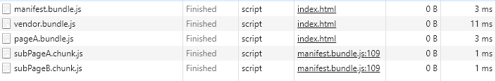
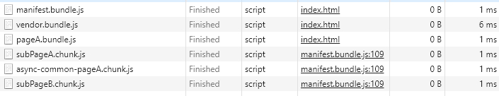

# webpack代码分割

代码分割Code Splitting一般需要做这些事情：

* 为 Vendor 单独打包（Vendor 指第三方的库或者公共的基础组件，因为 Vendor 的变化比较少，单独打包利于缓存）
* 为 Manifest （Webpack 的 Runtime 代码）单独打包
* 为不同入口的业务代码打包，也就是代码分割异步加载（同理，也是为了缓存和加载速度）
* 为异步公共加载的代码打一个的包

来自蚂蚁金服数据体验技术[Webpack 4 配置最佳实践](https://juejin.im/post/5b304f1f51882574c72f19b0)，这里虽然用的webpack3，也同样试用。

下面就用Code Splitting来实现上面几点。

## code splitting

webpack的代码分割Code Splitting，主要有两种方式：

> 第一种：webpack1通过require.ensure定义分割点，将代码进行分割打包，异步加载。

> 第二种：在动态代码拆分方面，webpack支持符合ECMAScript提议的import()语法进行代码分割和异步加载。

### require.ensure代码分割

webpack 在编译时，会静态地解析代码中的 require.ensure()，同时将模块添加到一个分开的 chunk 当中，这个新的 chunk 会被 webpack 通过 jsonp 来异步加载，其他包则会同步加载。

* 语法:

```js
require.ensure(dependencies: String[], callback: function(require), chunkName: String)
```

* 参数：

第一个参数是dependencies依赖列表，webpack会加载模块，但不会执行。

第二个参数是一个回调，当所有的依赖都加载完成后，webpack会执行这个回调函数，在其中可以使用require导入模块，导入的模块会被代码分割到一个分开的chunk中。

第三个参数指定第二个参数中代码分割的chunkname。

将下面代码拷贝到webpack.config.RequireEnsure.js：

```js
var webpack = require('webpack');
var path = require('path');
module.exports = {
    entry: {
        'pageA': './src/pageA',
        'vendor': ['lodash'] // 指定单独打包的第三方库(和CommonsChunkPlugin结合使用)，可以用数组指定多个
    },
    output: {
        path: path.resolve(__dirname, './dist'),
        filename: '[name].bundle.js',
        chunkFilename: '[name].chunk.js', // code splitting的chunk是异步(动态)加载，需要指定chunkFilename(具体可以了解和filename的区别)
    },
    plugins: [
        // 为第三方库和和manifest(webpack runtime)单独打包
        new webpack.optimize.CommonsChunkPlugin({
            name: ['vendor', 'manifest'],
            minChunks: Infinity
        }),
    ]
}
```

src/pageA.js、src/subPageA.js、src/subPageB.js、src/module.js代码如下：

```js
// src/pageA.js
import * as _ from 'lodash';
import subPageA from './subPageA';
import subPageB from './subPageB';
console.log('this is pageA');
export default 'pageA';

// src/subPageA.js
import module from './module';
console.log('this is subPageA');
export default 'subPageA';

// src/subPageB.js
import module from './module';
console.log('this is subPageB');
export default 'subPageB';

// src/module.js
const s = 'this is module'
export default s;

```

其中subPageA和subPageB模块使用共同模块module.js，命令行运行webpack --config webpack.config.RequireEnsure.js，打包生成：

```
pageA.bundle.js
vendor.bundle.js // 为 Vendor 单独打包
manifest.bundle.js // 为Manifest单独打包
```

满足我们文档一刚开始说的代码分割的两点要求，但是我们想要subPageA和subPageB单独打包：

修改src/pageA.js，把import导入方式改成require.ensure的方式就可以代码分割：
```js
// import subPageA from './subPageA';
// import subPageB from './subPageB';
require.ensure([], function() {
    // 分割./subPageA模块
    var subPageA = require('./subPageA');
}, 'subPageA');
require.ensure([], function () {
    var subPageB = require('./subPageB');
}, 'subPageB');
```
再次打包，生成：

```
pageA.bundle.js
subPageA.chunk.js // 代码分割
subPageB.chunk.js
vendor.bundle.js // 为 Vendor 单独打包
manifest.bundle.js // 为Manifest单独打包
```

会发现用了require.ensure的模块被代码分割了，达到了我们想要的目的，但是由于subPageA和subPageB有公共模块module.js，打开subPageA.chunk.js和subPageB.chunk.js发现都有公共模块module.js，这时候就需要在require.ensure代码前面加上require.include('./module')

src/pageA.js：
```js
require.include('./module'); // 加在require.ensure代码前
```
再次打包，公共模块modle.js被打包在了pageA.bundle.js，解决了为异步加载的代码打一个公共的包问题。

最后测试一下webpack打包后的动态加载/异步加载：

在index.html里面引入打包文件：

```html
<html>
    <body>
        <script src="./dist/manifest.bundle.js"></script>
        <script src="./dist/vendor.bundle.js"></script>
        <script src="./dist/pageA.bundle.js"></script>
    </body>
</html>
```
webpack.config.RequireEnsure.js加上动态加载路径的配置后再次打包：

```js
output: {
    ...
    publicPath: './dist/' // 动态加载的路径
}
```
浏览器中打开index.html文件，会发现subPageA.chunk.js和subPageB.chunk.js没有引入也被导入了进来。其实这两个文件是webpack runtime打包文件根据代码分割的文件自动异步加载的。




### dynamic import 代码分割

requre.ensure好像已被webpack4废弃。es6提供了一种更好的代码分割方案也就是dynamic import（动态加载）的方式，webpack打包时会根据import()自动代码分割；虽然在提案中，可以安装babel插件兼容，推荐用这种方式：

* 语法：

```js
import(/* webpackChunkName: chunkName */ chunk)
.then( res => {
    // handle something
})
.catch(err => {
    // handle err
});
```

其中/* chunkName */为指定代码分割包名，chunk指定需要代码分割的文件入口。注意不要把 import关键字和import()方法弄混了，该方法是为了进行动态加载。

> import()调用内部使用promises。如果您使用import()较旧的浏览器，请记住Promise使用诸如es6-promise或promise-polyfill之类的polyfill进行填充。

下面修改pageA.js：

```js
import * as _ from 'lodash';
import(/* webpackChunkName: 'subPageA' */'./subPageA').then(function(res){
    console.log('import()', res)
})
import(/* webpackChunkName: 'subPageB' */'./subPageB').then(function(res){
    console.log('import()', res)
})

console.log('this is pageA');
export default 'pageA';
```

将下面代码拷贝到webpack.config.import.js：

```js
var webpack = require('webpack');
var path = require('path');
module.exports = {
    entry: {
        'pageA': './src/pageA',
        'vendor': ['lodash'] // 指定单独打包的第三方库(和CommonsChunkPlugin结合使用)，可以用数组指定多个
    },
    output: {
        path: path.resolve(__dirname, './dist'),
        filename: '[name].bundle.js',
        chunkFilename: '[name].chunk.js', // code splitting的chunk是异步(动态)加载，需要指定chunkFilename(具体可以了解和filename的区别)
        publicPath: './dist/' // 动态加载的路径
    },
    plugins: [
        // 为第三方库和和manifest(webpack runtime)单独打包
        new webpack.optimize.CommonsChunkPlugin({
            name: ['vendor', 'manifest'],
            minChunks: Infinity
        }),
    ]
}
```

命令行webpack --config webpack.config.import.js，打包发现和require.ensure一样的结果：

```
pageA.bundle.js
subPageA.chunk.js // 代码分割
subPageB.chunk.js
vendor.bundle.js // 为 Vendor 单独打包
manifest.bundle.js // 为Manifest单独打包
```

为了分离出subPageA.chunk.js和subPageB.chunk.js的公共模块module.js，可以用CommonsChunkPlugin的async方式给异步加载的打包提取公共模块：

在webpack.config.import.js加上下面配置：（其实这种方式可以替代require.ensure中的require.include方式提取公共代码，更自动和简单）
```js
plugins: [
    // 为异步公共加载的代码打一个的包
    new webpack.optimize.CommonsChunkPlugin({
        async: 'async-common', // 异步公共的代码
        children: true, // 要加上children，会从入口的子依赖开始找
        minChunks: 2 // 出现2次或以上相同代码就打包
    }),
    ...
]
```

重新打包，打包文件如下：

```
pageA.bundle.js
subPageA.chunk.js // 代码分割
subPageB.chunk.js
async-common-pageA.chunk.js // 为异步公共加载的代码打的包
vendor.bundle.js // 为 Vendor 单独打包
manifest.bundle.js // 为Manifest单独打包
```
会发现多了一个异步加载包subPageA.chunk.js和subPageB.chunk.js的公共模块async-common-pageA.chunk.js包，配置成功！

同样，还是进行测试，index.html引入同步加载的包:

```html
<html>
    <body>
        <script src="./dist/manifest.bundle.js"></script>
        <script src="./dist/vendor.bundle.js"></script>
        <script src="./dist/pageA.bundle.js"></script>
    </body>
</html>
```

浏览器中打开index.html文件，会发现subPageA.chunk.js、subPageB.chunk.js和async-common-pageA.chunk.js被自动异步加载了。



### 关于异步加载和按需加载

关于文档中多次提到webpack代码分割的包，在浏览器中webpack runtime的包会自动异步加载代码分割的包，那么在react和vue应用中，如果这些代码分割包在页面初始化也会自动异步加载，那不是分包的作用不大？原因其实是我们上面例子执行了import()或require.ensure，而在应用中，写法是当请求路由的时候才执行import()或require.ensure，然后再异步加载，webpack遇到import()或require.ensure的配置的时候只会进行代码切割，这种思路就是按需加载的基础。

部分参考链接：

[代码分割 - 使用 require.ensure](https://www.html.cn/doc/webpack2/guides/code-splitting-require/)

关于代码分割后的按需加载，在各个框架react、vue中需要具体进行配置，但是都和上面webpack代码分割的两种方式有很大的关联性，下面是由webpack代码分割受到启发后研究的react按需加载配置和react-loadable库实现按需加载的原理解析的链接。
