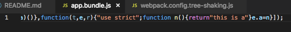

# webpack优化之tree-shaking

## 什么是tree-shaking

tree-shaking，最直接理解的意思就是通过"摇"，删除没用到的代码，可以通过去除无用代码以减少文件体积，提高加载文件速度，是一个webpack性能优化的范畴。

具体来说，在 webpack 项目中，有一个入口文件，相当于一棵树的主干，入口文件有很多依赖的模块，相当于树枝。实际情况中，虽然依赖了某个模块，但其实只使用其中的某些功能。通过 tree-shaking，将没有使用的模块摇掉，这样来达到删除无用代码的目的。tree-shaking不仅可以消灭不可能执行的代码（比如没有执行的函数），也可以去除无用代码（比如引用第三方库，只用到其中一部分代码，其他代码用不到，就需要webpack去除不打包），以达到减小文件体积的目的。

## tree-shaking的原理

Tree-shaking的本质是消除无用的js代码，当然我们后面也由此会针对css引入css-tree-sharking。tree-shaking的原理是利用ES6的静态引入规范，因为ES6模块的出现，ES6模块依赖关系是确定的，`和运行时的状态无关`，可以进行可靠的静态分析，这就是Tree shaking的基础。Tree-shaking减少包的体积，避免不必要的代码引入，webpack2也很快引入了这个特性。

所以如果要更好的使用Webpack Tree shaking,请满足：

* 使用ES2015(ES6)的模块
* 如果使用第三方的模块，尽量使用提供ES模块的版本

webpack tree-shaking从ES6顶层模块开始分析，可以清除未使用的模块(如import { button } from 'antd'但button未使用，webpack并不会打包)，它虽然很强大，但是依旧存在缺陷，很多情况下需要借助webpack内置的uglifyjs插件或者webpack-deep-scope-analysis-plugin来达到更好的tree-shaking。

## Js Tree Shaking

webpack可以用uglify来做tree-shaking，下面我们来看看如何用uglifyjs移除项目中无用代码的。

先来看看<font color=#FFA500>项目中引入无用代码的情况</font>：

在app.js中，引入common.js的a方法并执行：

```js
import { a } from './common';
a();
```

在common.js中，有多个方法：

```js
export function a() {
    return 'this is a';
}
export function b() {
    return 'this is b';
}
export function c() {
    return 'this is c';
}
```
我们把app.js作为入口文件用webpack打包，生成app.bundle.js，打开查看发现明明只引用了一个common.js中的方法，打包文件里面却有common.js中的所有方法。


### 无用代码的tree-sharking：

这时候就需要用到uglifyjs来进行tree shaking，webpack中通过内置插件`webpack.optimize.UglifyJsPlugin()`来进行tree shaking。

在webpack的配置文件里加上UglifyJsPlugin的配置：

```js
const webpack = require('webpack');
module.exports = {
    plugins: [
        new webpack.optimize.UglifyJsPlugin()
    ]
}
```
再次打包，生成app.bundle.js，打开查看项目中引入无用代码消失，只有a方法的代码：



### 第三方库的tree-shaking：

webpack3只能做比较简单的解决方案，比如项目中用到支持ES6引入规范的库lodash-es(lodash-es支持es模块)，webpack3竟然不能tree-shaking，需要升级到webpack4，亲测。

```js
import { isArray } from 'lodash-es';
export function lodashTest(value) {
    return isArray(value)
}
```
比如上面用到了lodash-es，但是webpack3把代码全部打包，webpack4就只打包isArray方法，大大减小了代码体积，所以快快升级webpack4吧。

关于掘金上很多文章所说[webpack-deep-scope-analysis-plugin](https://github.com/vincentdchan/webpack-deep-scope-analysis-plugin)可以对lodash-es做到tree-shaking，但是不支持webpack3；在webpack4中，webpack自己就可以对lodash-es进行tree-shaking，这样也就不需要webpack-deep-scope-analysis-plugin插件啦！所以网上很多文章是错误的，也或许是我用的webpack4版本更高。(亲测！)

如果用到babel编译，注意webpack 2.0 开始原生支持 ES Module，也就是说不需要 babel 把 ES Module 转换成曾经的 commonjs 模块了，想用上 Tree Shaking，请务必关闭 babel 默认的模块转义：

```js
{
    'presets': [
        [
            'env', { 'modules': false }
        ]
    ]
}
```

还有很多第三方组件库使用的时候，可以缩小引用范围tree-shaking，具体可以看百度外卖大前端技术团队的[Tree-Shaking性能优化实践-实践篇](https://juejin.im/post/5a4dca1d518825128654fa78)。


## CSS Tree Shaking

同理，js可以tree-shaking，css也可以进行tree-shaking，可以借助purifycss-webpack插件，可以达到项目中的某些css样式没用到就不会打包的效果，优化css体积。

安装：

```bash
npm i -D purify-css purifycss-webpack
# 安装处理多个路径的glob-all
npm i -D glob-all
```

配置：

```js
const globAll = require('glob-all');
const PurifyCSS = require('purifycss-webpack');
...
plugins: [
    // css tree-shaking去除无用的css
    new PurifyCSS({
        paths: globAll.sync([
            path.resolve(__dirname, './*.html'),
            path.resolve(__dirname, './src/*.js'),
        ])
    })
]
```

<font color=#FFA500>参考文档（表示感谢）：</font>

[Tree-Shaking性能优化实践-原理篇-
百度外卖大前端技术团队](https://juejin.im/post/5a4dc842518825698e7279a9)

[Tree-Shaking性能优化实践-实践篇-
百度外卖大前端技术团队](https://juejin.im/post/5a4dca1d518825128654fa78)

[体积减少80%！释放webpack tree-shaking的真正潜力-腾讯IVWEB团队](https://juejin.im/post/5b8ce49df265da438151b468)