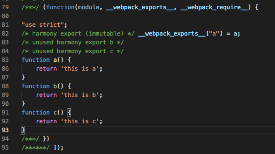

# webpack优化之tree-shaking

## 什么是tree-shaking

tree-shaking，最直接理解的意思就是通过"摇"，删除没用到的代码，可以通过去除无用代码以减少文件体积，提高加载文件速度，是一个webpack性能优化的范畴。

具体来说，在 webpack 项目中，有一个入口文件，相当于一棵树的主干，入口文件有很多依赖的模块，相当于树枝。实际情况中，虽然依赖了某个模块，但其实只使用其中的某些功能。通过 tree-shaking，将没有使用的模块摇掉，这样来达到删除无用代码的目的。tree-shaking不仅可以消灭不可能执行的代码（比如没有执行的函数），也可以去除无用代码（比如引用第三方库，只用到其中一部分代码，其他代码用不到，就需要webpack去除不打包），以达到减小文件体积的目的。

## tree-shaking的原理

Tree-shaking的本质是消除无用的js代码，当然我们后面也由此会针对css引入css-tree-sharking。
无用代码消除在广泛存在于传统的编程语言编译器中，编译器可以判断出某些代码根本不影响输出，然后消除这些代码，这个称之为DCE。那javascript中是由谁做DCE呢？不是rollup，webpack，而是著名的代码压缩优化工具uglify，<font color=#FFA500>uglify完成了javascript的DCE</font>。

## Js Tree Shaking

上面我们了解到webpack实际上使用uglify来做tree-shaking，下面我们来看看uglify是如何移除项目中无用代码的。

先来看看项目中引入无用代码的情况：

在app.js中，引入common.js的a方法并执行：

```js
import { a } from './common';
a();
```

在common.js中，有多个方法：

```js
export function a() {
    return 'this is a';
}
export function b() {
    return 'this is b';
}
export function c() {
    return 'this is c';
}
```
我们把app.js作为入口文件用webpack打包，生成app.bundle.js，打开查看发现明明只引用了一个common.js中的方法，打包文件里面却有common.js中的所有方法。



<font color=#FFA500>参考文档（表示感谢）：</font>

[Tree-Shaking性能优化实践-原理篇-
百度外卖大前端技术团队](https://juejin.im/post/5a4dc842518825698e7279a9)

[Tree-Shaking性能优化实践-实践篇-
百度外卖大前端技术团队](https://juejin.im/post/5a4dca1d518825128654fa78)